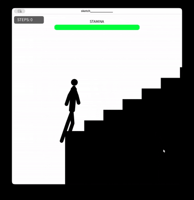

# Stair Climber 🏃‍♂️💨

> **疑似触覚（Pseudo-Haptics）と自己帰属感の相互作用による「身体的重量感」の検証アプリ**


キーボードの「上矢印キー」のみを使用し、スタミナの限界に抗いながら無限に続く階段を登るインタラクションプログラムです。視覚と操作の「ズレ」を利用して指先に重さを錯覚させる疑似触覚（Pseudo-Haptics）の実験、および検証用素材として開発しました。

---

## 🚀 作成背景（研究・開発の目的）

本プロジェクトは、大学の「インタラクションデザイン」の講義における**『感触体験インタラクションデザイン』**というテーマのもとで開発しました。通常、UXデザインにおいては「心地よさ・直感的な操作感」が求められますが、本作ではあえて**「意図的な心地悪さ（操作ストレス・重量感）」**を工学的に設計・検証することを目的としています。

開発にあたり、以下の2つの認知心理学・ヒューマンコンピュータインタラクション（HCI）の概念をコアロジックとして組み込みました。

1. **疑似触覚（Pseudo-Haptics）の応用**
   物理的な振動モーターなどの提示デバイスがない環境において、ユーザーの「キーボード入力」と「画面上のキャラクターの応答速度（視覚フィードバック）」にあえて**「指数関数的なズレ（遅れ）」**を生じさせることで、ユーザーの脳内に「指先が重い」「もどかしい」という物理的な錯覚（身体的重量感）を誘発させます。
2. **自己帰属感（Sense of Agency）の制御**
   「このキャラクターを動かしているのは自分だ」という感覚を強めるため、1:2:5の身体黄金比率や左右交互のリアルな歩行アニメーションを徹底しました。この自己帰属感が強力に作用している状態だからこそ、前述の「ズレ」が生じた際に、単なるシステムバグ（ずさんな設計）ではなく、**「自分自身のスタミナが限界を迎え、身体が重くなっている」という主観的な疲労感**へと昇華されます。

単なるゲームの「数値上の能力低下」という記号的処理にとどまらず、視覚と操作の相互作用によってデジタル空間に**「身体性の宿るリアルな感触体験」**を創出できるかという、インタラクションの可能性を模索した作品です。

---

## ✨ 主な機能

### 📸 画面イメージ & デモ動画

<p align="center">
  
  
</p>

<p align="center">
  
</p>

### 🏃‍♂️ 身体所有感を高める歩行ロジック

* **1:2:5の黄金比率**: 階段の蹴上げ（`stepH = 50`）に対し、足の長さ（`legL = stepH * 2.0`）、身長（`totalH = stepH * 5.0`）という、一段をしっかり踏みしめる動作が最も力強く伝わる独自の身体比率を採用。
* **連続歩行アニメーション**: 左右の足が揃わず交互に進むリアルな足運び（`isLeftStep` フラグによる分岐）により、「画面内のキャラクターは自分である」という自己帰属感（Sense of Agency）を強化。

### 🤢 誇張された動的疲労演出

スタミナの減少（`staminaRatio` の低下）に伴い、単純な減速だけでなく、実際の人間が限界を迎えたときの症状を大袈裟に表現しています。

* **重力による沈み込み**: 疲労度 `f` に応じてキャラクター全体の重心が低く沈み込む（変数 `slump` による制御）。
* **重心のふらつき (Wobble)**: 筋肉のコントロールを失う様子を表現するため、全体が左右に揺れる（`cos(frameCount * 0.08) * 8 * f * s`）。
* **足の上がりの低下 (Lift量の減少)**: 足の上がる高さ（`lift`）が最大で通常の20%まで低下。階段の角をかすめるような重々しい足運びへ変化。
* **生理的ノイズ (呼吸・震え)**: 肩が深く上下する重い息づかい（`breath`）や、スタミナ限界時（`ratio < 0.15`）の膝の微細な震え（`random` によるノイズ）を再現。

### 📊 動的UI（リアルタイムフィードバック）

* **中央配置のスタミナゲージ**: 画面最上部中央に配置。スタミナの増減に合わせて「緑 ➔ 黄 ➔ 赤」へとカラーが滑らかにグラデーション変化（`lerpColor` 利用）。
* **ピンチ警告**: スタミナが10%を切ると `"EXHAUSTED!"` の警告テキストが高速で点滅（`frameCount % 30 < 15` による制御）し、視覚的なストレスを強調。
* **カウンター**: 登った段数（`stepCount`）を左上の半透明なコンパクトボックスに集約。

---

## ⚙️ システム構成（アルゴリズムフロー）

```text
[ ユーザー入力: UPキー長押し ]
       │
       ▼
[ スタミナの動的減算処理 ] ─── (10%未満で "EXHAUSTED!" 点滅表示)
       │
       ▼
[ 疲労度パラメータの算出 ] ─── (powおよびlerpによる歩行速度制限と沈み込み)
       │
       ▼
[ 生理的ノイズ（振幅）の計算 ] ─ (sin/cosによる肩の上下、randomによる膝の震え)
       │
       ▼
[ 画面への描画（視覚フィードバック）] ➔ 🧠【指先への疑似触覚の発生】
```

---

## 💻 注目コード（コアロジックの抜粋）

本作のコアである「疑似触覚を生み出す非線形な減速制御」および「生理的な疲労ノイズ」の実際の実装部分です。

### 1. 指数関数による非線形なスピード減速（Pseudo-Hapticsの核）

ただ減速させるのではなく、スタミナ残量（`staminaRatio`）の低下に応じて「もっさりとした重量感」を指先に錯覚させるため、`pow(staminaRatio, 0.6)` による非線形な速度変化を適用しています。

```java
// スタミナの割合(0.0〜1.0)から疲労度を計算
float staminaRatio = stamina / maxStamina;
float fatigue = 1.0 - staminaRatio; 

// 指数関数を用いて、スタミナ低下時に急激に速度が落ちるよう制限
float currentWalkSpeed = 0.03 * pow(staminaRatio, 0.6);  

if (keyPressed && keyCode == UP && stamina > 0.1) {
  walkCycle += currentWalkSpeed; // 歩行サイクルの更新
  stamina = max(stamina - 0.15, 0); // スタミナの消費
} else {
  stamina = min(stamina + 0.3, maxStamina); // スタミナの自動回復
}
```

### 2. 多重ノイズによるリアルな疲労身体表現

`sin`/`cos` 関数を用いた周周期的なノイズ（呼吸・ふらつき）と、スタミナ限界付近（15%未満）で発生する不規則ノイズ（膝の震え）を組み合わせることで、「しんどさ」を視覚的に誇張しています。

```java
// 1. 肩の呼吸表現（サイン波を利用して垂直方向に周期的なノイズを加算）
float breath = sin(frameCount * 0.15) * 6 * f; 

// 2. 全体の揺れ・重心のふらつき（コサイン波による水平方向の慣性表現）
float wobble = cos(frameCount * 0.08) * 8 * f * s;

// 3. 足の上がりの低下（スタミナ低下に伴い、最大Lift量が通常の20%までデグレードする）
float normalLift = -80 * s;
float lift = normalLift * (0.2 + 0.8 * ratio) * sin(p * PI); 

// 4. 膝の微細な震え（スタミナが15%を切ると、ランダム関数による不規則な震えをインジェクション）
float shakeRange = 3 * f * f; 
float shake = (ratio < 0.15) ? random(-shakeRange, shakeRange) : 0;
```

---

## 💡 工夫した点

* **操作ストレスの徹底的な排除（デモ対策）**
  従来の文字キー入力（Wキーなど）では、実行ウィンドウからフォーカスが外れた際にエディタ側へ大量の文字が誤入力される問題がありました。本作では入力を「上矢印キー（UP）」に完全固定（`keyCode == UP` 利用）したことで、エディタを汚さず、安全かつスマートにデモを行えるようにしました。
* **斜めにならない姿勢の固定**
  疲労表現を強める際、体を無理に前傾させるとシルエットの美しさが損なわれるため、あえて姿勢の傾き（`lean = radians(5)`）は5度（ほぼ垂直付近）で固定。その代わり、垂直方向の「沈み込み（`slump`）」や水平方向の「揺れ（`wobble`）」を強調することで、スタイリッシュさを保ったまま「しんどさ」の表現に成功しました。

---

## 🛠️ 使用技術

| カテゴリ | 技術・ツール |
| :--- | :--- |
| **言語** | Java (Processing) |
| **描画・物理演算** | Processing Core (2D プリミティブによる幾何学描画) |
| **入力制御** | キーボード（上矢印キー長押し判定） |
| **主なロジック** | 線形補間（`lerp`）、色補間（`lerpColor`）、指数関数減速（`pow`）、三角関数（`sin` / `cos`） |
| **開発環境** | Processing IDE |

---

## 🔮 今後の展望（ロードマップ）

- [ ] **複数パラメータの可変 UI 実装**: 画面上で「階段の勾配」や「スタミナ消費率」をシームレスに変更できるスライダーの追加。
- [ ] **入力デバイスの多様化**: マウスホイールの回転速度や、スマホの長押し圧感知（Force Touch）などへの対応。
- [ ] **自己帰属感を高めるサウンドデザイン**: 心音（BPMの変化）や、着地時の「ドスン」という重い足音の動的生成。
- [ ] **ベクター最適化（加工連携）**: 登った軌跡（パス）をレーザー加工用データ（SVG）として出力する機能の追加。

---

## 📄 ライセンス

[MIT License](LICENSE)
```
