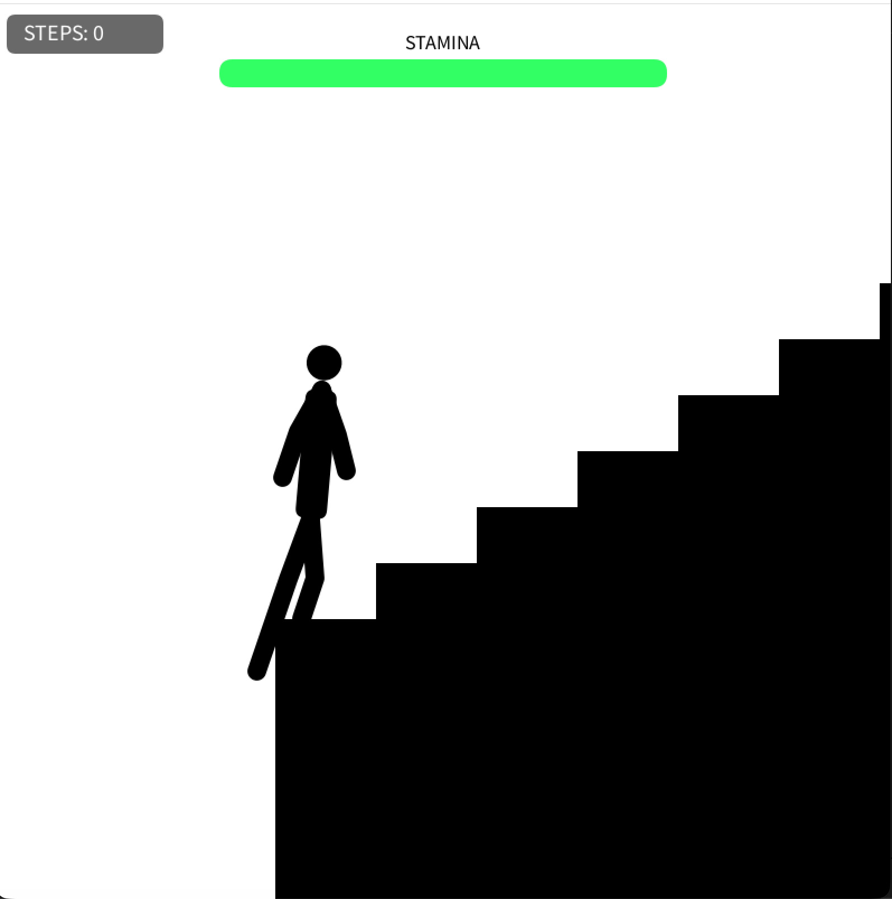
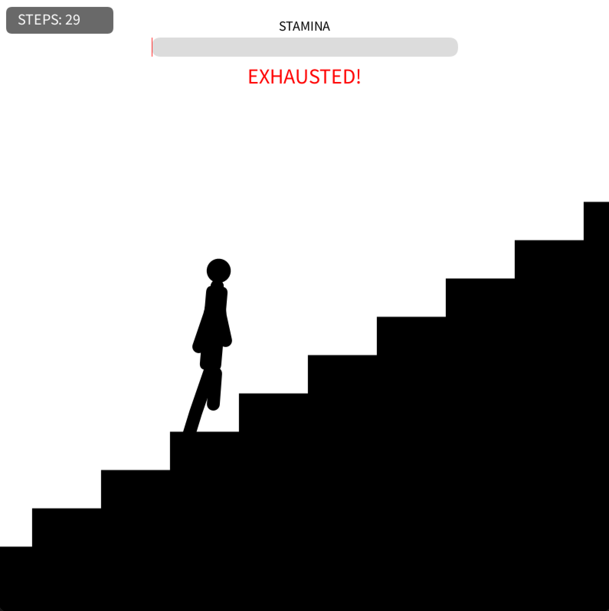

# Stair Climber 🏃‍♂️💨
> **疑似触覚（Pseudo-Haptics）と自己帰属感の相互作用による「身体的重量感」の検証アプリ**

キーボードの「上矢印キー」のみを使用し、スタミナの限界に抗いながら無限に続く階段を登るインタラクションプログラムです。視覚と操作の「ズレ」を利用して指先に重さを錯覚させる疑似触覚（Pseudo-Haptics）の実験、および検証用素材として開発しました。

---

## 🚀 作成背景（研究・開発の目的）

本プロジェクトは、大学の「インタラクションデザイン」の講義における『感触体験インタラクションデザイン』というテーマのもとで開発しました。通常、UXデザインにおいては「心地よさ・直感的な操作感」が求められますが、本作ではあえて「意図的な心地悪さ（操作ストレス・重量感）」を工学的に設計・検証することを目的としています。

開発にあたり、以下の2つの認知心理学・ヒューマンコンピュータインタラクション（HCI）の概念をコアロジックとして組み込みました。

1. **疑似触覚（Pseudo-Haptics）の応用**
   物理的な振動モーターなどの提示デバイスがない環境において、ユーザーの「キーボード入力」と「画面上のキャラクターの応答速度（視覚フィードバック）」にあえて**　「指数関数的なズレ（遅れ）」　**を生じさせることで、ユーザーの脳内に「指先が重い」「もどかしい」という物理的な錯覚（身体的重量感）を誘発させます。
2. **自己帰属感（Sense of Agency）の制御**
   「このキャラクターを動かしているのは自分だ」という感覚を強めるため、1:2:5の身体黄金比率や左右交互のリアルな歩行アニメーションを徹底しました。この自己帰属感が強力に作用している状態だからこそ、前述の「ズレ」が生じた際に、単なるシステムバグ（ずさんな設計）ではなく、「自分自身のスタミナが限界を迎え、身体が重くなっている」という主観的な疲労感へと昇華されます。

単なるゲームの「数値上の能力低下」という記号的処理にとどまらず、視覚と操作の相互作用によってデジタル空間に「身体性の宿るリアルな感触体験」を創出できるかという、インタラクションの可能性を模索した作品です。

---

## ✨ 主な機能

### 📸 画面イメージ（初期状態と疲労時の比較）

  
  

### 🏃‍♂️ 身体所有感を高める歩行ロジック
* **1:2:5の黄金比率**: 階段の蹴上げ（1）に対し、足の長さ（2）、身長（5）という、一段をしっかり踏みしめる動作が最も力強く伝わる独自の身体比率を採用。
* **連続歩行アニメーション**: 左右の足が揃わず交互に進むリアルな足運びにより、「画面内のキャラクターは自分である」という自己帰属感（Sense of Agency）を強化。

### 🤢 誇張された動的疲労演出
スタミナの減少に伴い、単純な減速（指数関数的なタメ）だけでなく、実際の人間が限界を迎えたときの症状を大袈裟に表現しています。
* **重力による沈み込み**: 疲労度に応じてキャラクター全体の重心（トルソ）が低く沈み込む。
* **重心のふらつき (Wobble)**: 筋肉のコントロールを失う様子を表現するため、全体が左右に「のっそり」と揺れる。
* **Toe Drag (爪先の引っかかり)**: 足の上がる高さ（Lift量）が最大で通常の10%まで低下。階段の角をかすめるような重々しい足運びへ変化。
* **生理的ノイズ (呼吸・震え)**: 肩が深く上下する重い息づかいや、スタミナ限界時の膝の微細な震えを再現。

### 📊 動的UI（リアルタイムフィードバック）
* **中央配置のスタミナゲージ**: 画面最上部中央に大きく配置。スタミナの増減に合わせて「緑 ➔ 黄 ➔ 赤」へとカラーが滑らかにグラデーション変化（`lerpColor` 利用）。
* **ピンチ警告**: スタミナが10%を切ると `"EXHAUSTED!"` の警告テキストが高速で点滅し、視覚的なストレスを強調。
* **カウンター**: 登った段数（STEPS）を左上の半透明なコンパクトボックスに集約。

---

## 💡 工夫した点

* **操作ストレスの徹底的な排除（デモ対策）**
  従来の文字キー入力（Wキーなど）では、実行ウィンドウからフォーカスが外れた際にエディタ側へ大量の文字が誤入力される問題がありました。本作では入力を「上矢印キー（UP）」に完全固定（`keyCode` 利用）したことで、エディタを汚さず、安全かつスマートにデモを行えるようにしました。
* **斜めにならない姿勢の固定**
  疲労表現を強める際、体を無理に前傾させるとシルエットの美しさが損なわれるため、あえて姿勢の傾き（5度）は垂直付近で固定。その代わり、垂直方向の「沈み込み」や水平方向の「揺れ」を強調することで、スタイリッシュさを保ったまま「しんどさ」の表現に成功しました。

---

## 🛠️ 使用技術

| カテゴリ | 技術・ツール |
| :--- | :--- |
| **言語** | Java (Processing) |
| **描画・物理演算** | Processing Core (2D プリミティブ) |
| **入力制御** | キーボード（上矢印キー長押し） |
| **主なロジック** | 線形補間（`lerp`）、色補間（`lerpColor`）、指数関数減速、サイン波（呼吸表現） |
| **開発環境** | Processing IDE |

---

## 🔮 今後の展望（ロードマップ）

- [ ] **複数パラメータの可変 UI 実装**: 画面上で「階段の勾配」や「スタミナ消費率」をシームレスに変更できるスライダーの追加。
- [ ] **入力デバイスの多様化**: マウスホイールの回転速度や、スマホの長押し圧感知（Force Touch）などへの対応.
- [ ] **自己帰属感を高めるサウンドデザイン**: 心音（BPMの変化）や、着地時の「ドスン」という重い足音の動的生成。
- [ ] **ベクター最適化（加工連携）**: 登った軌跡（パス）をレーザー加工用データ（SVG）として出力する機能の追加。

---

## 📄 ライセンス
[MIT License](LICENSE)
